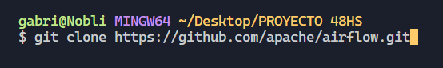
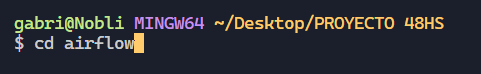
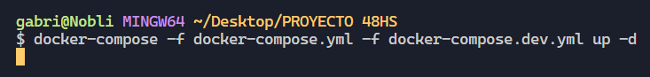
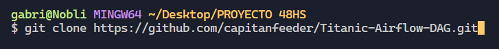
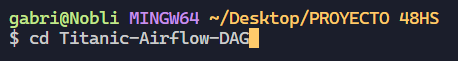
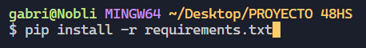

# **`Titanic DAG Project in Apache Airflow`**

## **`Project Description`**

### This project aims to automate the data processing workflow for the Titanic dataset using Apache Airflow. The Directed Acyclic Graph (DAG) created in Airflow orchestrates the tasks of downloading, transforming, and loading the dataset into a PostgreSQL database.

## **`Workflow Overview:`**
- **Data Download:** Fetches the Titanic dataset from a public URL using the download_csv task.

- **Data Quality:** Generates a data quality report and performs transformations on the dataset to enhance its quality using the DataQuality/profiling and DataQuality/curated tasks.

- **Raw Data Layer:** Establishes a PostgreSQL table to store the raw dataset using the RawLayer/create_raw task, followed by loading the data into this table using the RawLayer/load_raw task.

- **Master Data Layer:** Sets up a master table in the PostgreSQL database to store the transformed data using the MasterLayer/create_master task. The transformed data is then loaded into this table using the MasterLayer/load_master task.

- **Data Validation:** Utilizes a SQL sensor to validate that the data has been correctly loaded into the master table using the validator task.

## **`Prerequisites`**
- Docker
- DBeaver or another PostgreSQL-compatible database management tool
- Environment Setup

## **1) Docker Installation:**

- Follow the installation instructions for Docker on your operating system from the official Docker documentation.

## **2) Airflow Setup with Docker:**

- Clone the Apache Airflow repository:

- Navigate to the airflow directory:

- Build and run Airflow with Docker using the following command:

- Airflow will be accessible via the web interface at **http://localhost:8080**.

## **3) Database Connection with DBeaver:**

### **Installation Instructions:**

- **Download and Install DBeaver:**
    - Visit the [official website](https://dbeaver.io/) and download DBeaver.
    - Follow the installation instructions for your operating system.

- **Configure PostgreSQL Connection:**
    - Open DBeaver.
    - Go to the "Database" menu and select "New Database Connection."
    - Choose "PostgreSQL" as the connection type.

    **Connection Details:**
    - Host: localhost (or your PostgreSQL instance address)
    - Port: 5432 (or your PostgreSQL port)
    - Database: Your database name
    - User: Your username
    - Password: Your password

- **Save and Test Connection:**
    - Save the connection settings.
    - Test the connection to ensure it is configured correctly.

## **`Replication Steps:`**

## **1) Clone the repository:**

## **2) Navigate to the project directory and install dependencies::**

## **3) Airflow and PostgreSQL Configuration:**

- Configure Airflow as per the official documentation.

- Set up the PostgreSQL connection in Airflow.

## **4) Run the DAG in Airflow:**

- Start the Airflow web server and scheduler.

- Access the Airflow web interface and activate the dag_test DAG.

- Verify that the DAG runs successfully and all tasks complete.

## **5) Validate Results:**

- Ensure that the transformed data is correctly loaded into the master table in the PostgreSQL database.

## **`Conclusion`**

### This project showcases the utilization of Apache Airflow to automate the data processing workflow, contributing to the efficiency and reproducibility of the project.

## `Technologies Used`

## **`Operation demonstration:`** [vídeo](https://www.youtube.com/watch?v=xbXJeMXNE6U)